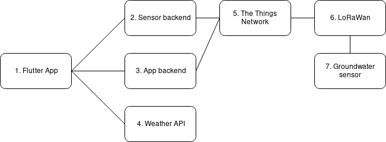

# Groundwater Documentation
This project uses Flutter for the app and Spring Boot for the backend.

## Introduction
Enschede has had a problem with groundwater for many years. During heavy rainfall, the streets and basements of a lot of houses will flood. Certain houses have permanently flooded basements. The main reason for this is the complex composition of the earth below our feet and the rising water levels. Due to the drastic differences in the composition of the earth from one house to the other, one neighbour might have flooded basements, while others are completely dry. This can also change over time.

In order to give the citizens of Enschede more of an insight into the groundwater levels, a project was started at the end of 2018. This pilot project collects data provided by citizens that suffer from problems related to high groundwater levels. This data will be used to provide an overview of changes in groundwater levels over time. This, in combination with the actions that citizens take to combat the groundwater, and their effects, will be used to help others.

The current pilot project consists of 10 households that have installed a professional groundwater sensor.

## Architecture

1. The Flutter app - For this project, we are going to develop a hybrid app using Flutter. This app will give users insight into measurements made by groundwater sensors and historical weather data from a weather API as well as predicted groundwater levels.

    A group of civil engineering students have previously done a project regarding the problems surrounding the rising groundwater levels. We have implemented a part of their research in our app which is called a decision tree. This decision tree allows users to make an educated decision on a course of action to try and find a solution for their problems.

    Users will be able to users register their own sensor in the application, which allows it to broadcast its findings over the things network. The app backend is used to login and register new users as well as registering the sensor.

2. Sensor backend - The Smart Cities lectoraat has created a backend which makes the sensor data available to us. One of the requirements of the project is to be able to add personal notes to specific data points. This “note” model does not yet exist, however, we will provide a specification which after being accepted will be implemented.

    The API will mostly be used to request sensor data to be displayed in the app. If the note specification is implemented it will be used to create notes as well. In the Flutter app on the advanced statistics page, users can select which sensor’s data they want to display. A sensor’s location is stored in the sensor backend. The sensor backend obtains the measurements made by the groundwater sensors through the things network

3. App backend - The sensor backend developed by the Smart Cities lectoraat does not store user accounts. Because we want users to have to login in order to view sensor data and register new groundwater sensors, a separate backend will have to be developed. This backend will handle user logins and user registrations.

4. Weather API - We are going to display weather data from an external API in the Flutter application. This data will come in the form of historical, current, and future weather data. Users will be able to see a correlation between the weather and the groundwater levels in graphs. Besides this, the weather data will also be used to send notifications that might warn users in time for rising groundwater levels.

5. The Things Network - Provides a global open LoRa network. It receives the data that is sent from the groundwater sensors, which can then be requested through the sensor backend. New sensors will also have to be registered in The Things Network.

6. LoRaWan - LoRaWan stands for Long Range Wide Area Network. Groundwater sensors will send their data through this network to The Things Network.

7. Groundwater sensor - The groundwater sensor is housed in a four-meter long tube. The sensor uses ultrasonic frequencies to measure the groundwater level underneath it. It is also able to measure the temperature and the time at which the measurement is made. Measurements are done regularly, and their results are then transferred through LoRaWan to the things network.

## Requirements
<table>
  <tr>
   <td>#
   </td>
   <td>Requirement
   </td>
   <td>MoSCoW
   </td>
  </tr>
  <tr>
   <td>1
   </td>
   <td><a href="https://github.com/sachafulep/groundwater/milestone/1">Implement line graph that shows measurement data in a range of time. (e.g. groundwater level, precipitation, groundwater levels from other sensors.)</a>
   </td>
   <td>must
   </td>
  </tr>
  <tr>
   <td>2
   </td>
   <td><a href="https://github.com/sachafulep/groundwater/milestone/2">Allow the user to toggle on and off data sets in the line graph (e.g. groundwater level, precipitation, groundwater levels from other sensors.)</a>
   </td>
   <td>must
   </td>
  </tr>
  <tr>
   <td>3
   </td>
   <td><a href="https://github.com/sachafulep/groundwater/milestone/3">Show interpretation of the data in understandable pieces of text on the detail screen (e.g. “groundwater is at this level, meaning it is 50 cm below your cellar)

Show additional textual information to clarify the graph</a>
   </td>
   <td>must
   </td>
  </tr>
  <tr>
   <td>4
   </td>
   <td><a href="https://github.com/sachafulep/groundwater/milestone/4">User can select at what predicted precipitation level to receive a “precipitation level notification” (e.g. send me a notification if precipitation tomorrow will be above 5 mm)</a>
   </td>
   <td>must
   </td>
  </tr>
  <tr>
   <td>5
   </td>
   <td><a href="https://github.com/sachafulep/groundwater/milestone/4">User can select at what predicted precipitation duration to receive a “precipitation duration notification” (e.g. send me a notification if there will be precipitation for longer than 2 hours)</a>
   </td>
   <td>must
   </td>
  </tr>
  <tr>
   <td>6
   </td>
   <td><a href="https://github.com/sachafulep/groundwater/milestone/5">User can select at what probability of precipitation to receive a “precipitation level notification” (e.g. send me a notification when there is a 50% chance of precipitation tomorrow)</a>
   </td>
   <td>must
   </td>
  </tr>
  <tr>
   <td>7
   </td>
   <td><a href="https://github.com/sachafulep/groundwater/milestone/6">User can select at what groundwater level to receive a “groundwater level notification” (e.g. send me a notification when groundwater level is at 400 cm depth)</a>
   </td>
   <td>must
   </td>
  </tr>
  <tr>
   <td>8
   </td>
   <td><a href="https://github.com/sachafulep/groundwater/milestone/7">Add / edit / delete notes to certain data points</a>
   </td>
   <td>must
   </td>
  </tr>
  <tr>
   <td>9
   </td>
   <td><a href="https://github.com/sachafulep/groundwater/milestone/8">A decision tree which can be used to find a possible solution for the flooding</a>
   </td>
   <td>must
   </td>
  </tr>
  <tr>
   <td>10
   </td>
   <td><a href="https://github.com/sachafulep/groundwater/milestone/9">Users can verify themselves with the unique id of their sensor in order to register</a>
   </td>
   <td>must
   </td>
  </tr>
  <tr>
   <td>11
   </td>
   <td><a href="https://github.com/sachafulep/groundwater/milestone/10">Users can log in to the app with their Google account
   </td>
   <td>must
   </td>
  </tr>
  <tr>
   <td>12
   </td>
   <td><a href="https://github.com/sachafulep/groundwater/milestone/11">The user should be able to change their information</a>
   </td>
   <td>must
   </td>
  </tr>
  <tr>
   <td>13
   </td>
   <td><a href="https://github.com/sachafulep/groundwater/milestone/12">The app onboards the user when registering by asking them to register a sensor</a>
   </td>
   <td>should
   </td>
  </tr>
  <tr>
   <td>14
   </td>
   <td><a href="https://github.com/sachafulep/groundwater/milestone/13">The app works in both landscape and portrait mode</a>
   </td>
   <td>could
   </td>
  </tr>
  <tr>
   <td>15
   </td>
   <td><a href="https://github.com/sachafulep/groundwater/milestone/14">Users can register a sensor to their account by pairing the sensor with their phone using Bluetooth</a>
   </td>
   <td>could
   </td>
  </tr>
  <tr>
   <td>16
   </td>
   <td><a href="https://github.com/sachafulep/groundwater/milestone/15">The user can register multiple sensors to their account</a>
   </td>
   <td>could
   </td>
  </tr>
  <tr>
   <td>17
   </td>
   <td><a href="https://github.com/sachafulep/groundwater/milestone/16">The user can get a visual of his current groundwater state</a>
   </td>
   <td>must
   </td>
  </tr>
  <tr>
   <td>18
   </td>
   <td><a href="https://github.com/sachafulep/groundwater/milestone/17">Predict the groundwater level based on weather data and various data sources</a>
   </td>
   <td>could
   </td>
  </tr>
</table>

## [Documentation Frontend](docs/App.md)
## [Documentation Backend](docs/Backend.md)
## [Design](https://xd.adobe.com/view/3aa61371-5a12-4fb0-50a8-a0e6027284f9-4c97/grid)
