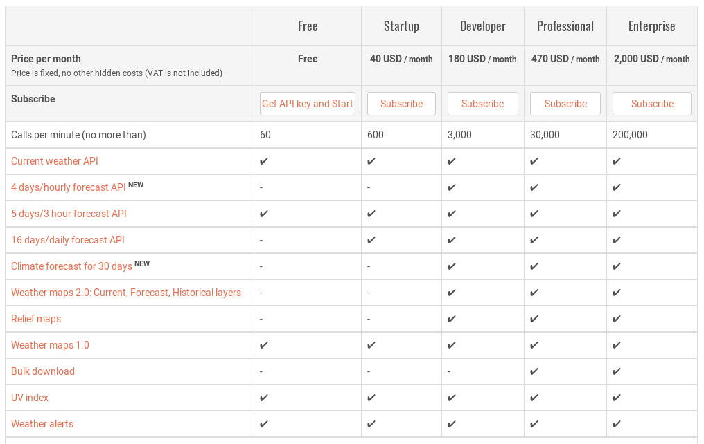
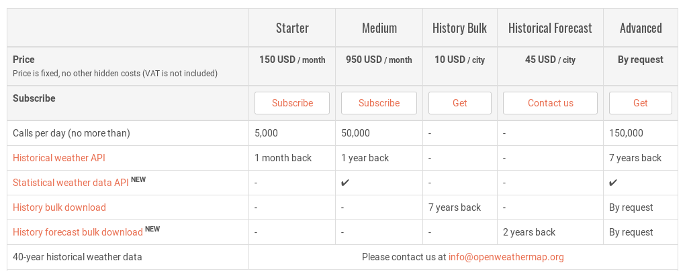
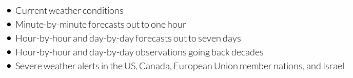
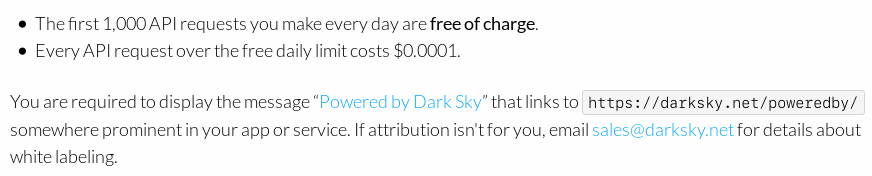
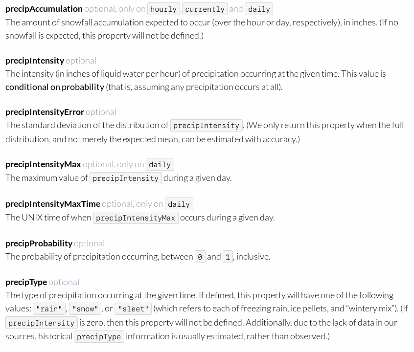
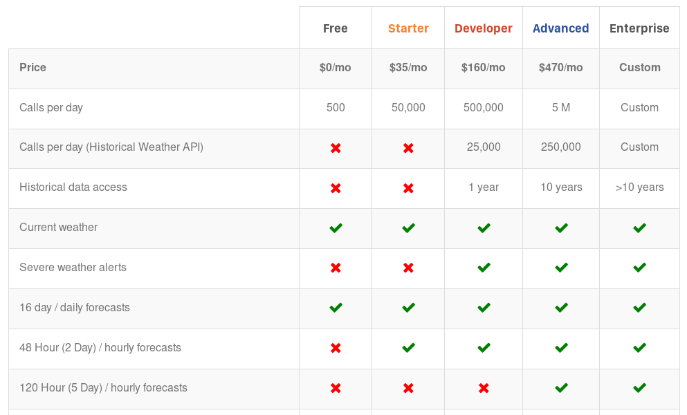
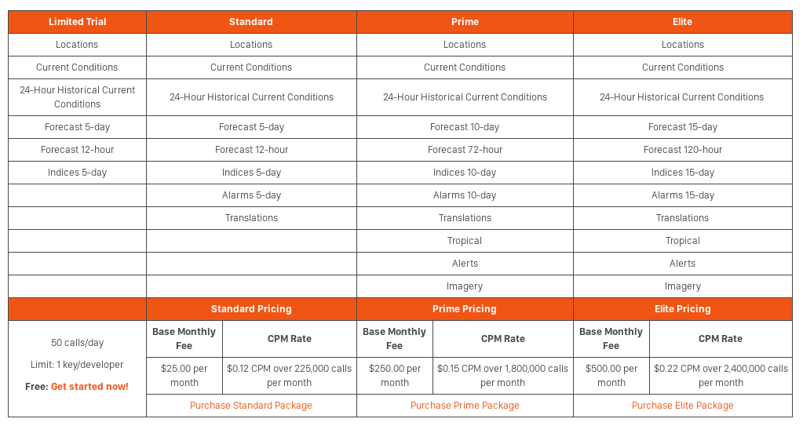

Requirements
============

Our app makes use of weather data in the following ways:

-   Display precipitation levels (historical, current, and forecasted)

-   Historical data should go back at least one year

-   Requests based on coordinates

-   Results have to include the type of precipitation

-   Forecasted data at least 5 days ahead

-   Notify users at certain precipitation levels, and chances

-   Results have to include the forecasted chance of precipitation

Our app currently has 10 users that can through regular use send multiple request in fairly rapid succession.

OpenWeather
===========

Pricing and features
--------------------

### Current / forecasted weather

All 

-   + Requests based on coordinates

-   - No precipitation change values

Free license 

-   - 60 requests per minute (most likely not enough)

-   - No hourly forecast

-   ~ 3 hourly forecast limited to 5 days

-   ~ Forecast limited to 5 days

Startup license (most fitting for our requirements)

-   + 600 requests per minute (enough for our current user base with room to grow)

-   + Daily forecast up to 16 days instead of 5

-  =  disadvantage

~  =  neutral

+  =  advantage

### Historical weather

Medium license

-   + Historical weather API 1 year back

-   + 50,000 call per day

-   - very expensive 950 USD / month

History Bulk (most fitting for our requirements)

-   + 7 year history bulk download 

-   + affordable, 10 USD / per city (user base exclusively in one city at this point) 

-   ~ bulk data can be stored locally or in own database (increased complexity in code base, less reliance on external API, more reliance on own infrastructure / external database)

Expected total pricing
----------------------

Startup License  =  40 USD / per month

History Bulk   =  10 USD per city

Notes
-----

Affordable

User friendly

Good documentation

Dark Sky
========

Pricing and features
--------------------

Notes
-----

-   1000 requests per day for free (enough for our user base)

-   Forecast up to 7 days out

-   Historical data more than a year back

-   Requests based on coordinates

-   Precipitation types, probability and intensity in results

-   Requires one request per day which adds up to a lot of requests when a large timeframe is requested by a user.

Most suitable candidate so far

Weatherbit
==========

Pricing and features
--------------------

Developer license

-   + Forecast up to 16 days ahead

-   + 1 year of historical data

-   - expensive, 160 USD / month

-   - No percentage chance of precipitation

Accuweather
===========

Pricing and features
--------------------

Historical data only up to 24 hours back which makes this API unsuitable for our purposes